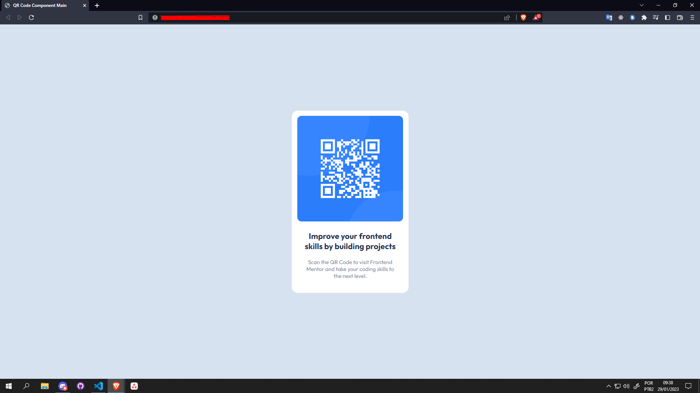

# Frontend Mentor - QR code component solution

This is a solution to the [QR code component challenge on Frontend Mentor](https://www.frontendmentor.io/challenges/qr-code-component-iux_sIO_H). Frontend Mentor challenges help you improve your coding skills by building realistic projects.

## Table of contents

- [Overview](#overview)
  - [Screenshot](#screenshot)
  - [Links](#links)
- [My process](#my-process)
  - [Built with](#built-with)
  - [What I learned](#what-i-learned)
  - [Continued development](#continued-development)
  - [Useful resources](#useful-resources)
- [Author](#author)
- [Acknowledgments](#acknowledgments)

**Note: Delete this note and update the table of contents based on what sections you keep.**

## Overview

### Screenshot



### Links

- Solution URL: [Add solution URL here](https://www.frontendmentor.io/solutions/a-simple-landing-page-with-the-card-component-a-LGIyr_l2)
- Live Site URL: [Add live site URL here](https://fty57.github.io/qr-code-component-main-v2/)

## My process

### Built with

- Semantic HTML5 markup
- CSS custom properties
- Flexbox
- Mobile-first workflow

### What I learned

I learned that using an outside tool, such as Lightshot, can help you measure the height and width of a component you don't know about. This makes it easier to discover these possible values.

I also learned that to fully center an element, you can use the body of the page as a reference. Thus:

```css
body {
  width: 100vw;
  height: 100vh;
}
```

### Continued development

The first time I developed this project, it was using React. And even though it's quite advanced, it's important to train the basics so you don't get lost when you get to use these frameworks. I will be more careful not to skip key steps.

### Useful resources

- [CHATGPT](https://chat.openai.com/) - I used some of the ChatGPT tips to help me with some component centralization questions. It's really amazing how quickly you can solve your problem with this tool, I think it will come in handy.

## Author

- Github - [@fty57](https://github.com/fty57)
- Frontend Mentor - [@fty57](https://www.frontendmentor.io/profile/fty57)

## Acknowledgments

A simple challenge, but very fundamental and important to train and review concepts. I'll go for the next ones.
